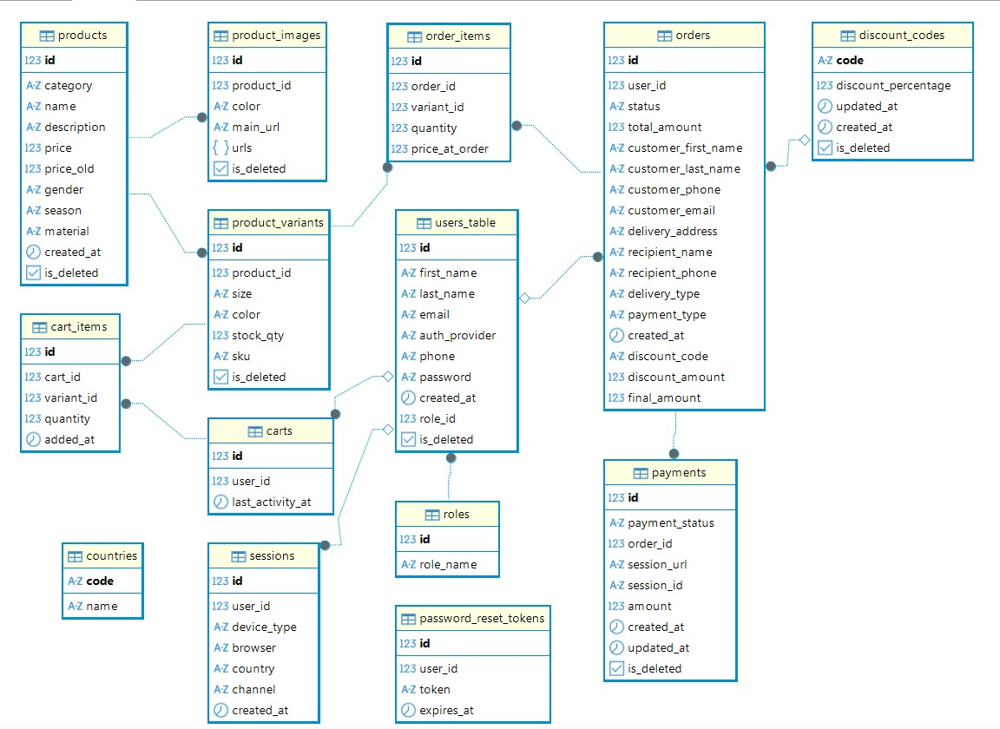

# Shoe Store Backend


A modern REST API for an e-commerce shoe store developed as a team project.

The application provides a complete backend for an online shoe store, including authentication, product management, shopping cart, order processing, Stripe payments, customer account management, and session tracking.

---

## 🌐 Live Demo

| Service | URL |
|---------|-----|
| Frontend | https://shoe-store-frontend-five-sable.vercel.app |
| Backend API | https://shoe-store.andziak.pl |
| Swagger UI | https://shoe-store.andziak.pl/swagger-ui/index.html |

---

## Features

- JWT authentication and role-based authorization
- Google Sign-In (OAuth 2.0)
- User registration with email verification
- Password reset via Brevo
- Product, variant, and image management
- Shopping cart
- Order management
- Stripe Checkout integration
- Discount code support
- CSV data importers
- Session tracking and analytics
- Soft delete
- Database versioning with Liquibase
- OpenAPI / Swagger documentation

---

## Tech Stack

| Category | Technologies |
|----------|--------------|
| **Backend** | Java 21, Spring Boot |
| **Security** | Spring Security, JWT, OAuth2 |
| **Database** | PostgreSQL 17, Hibernate, Spring Data JPA |
| **Database Versioning** | Liquibase |
| **Payments** | Stripe Checkout |
| **Email Service** | Brevo |
| **Build Tool** | Maven |
| **Deployment** | Docker, Ubuntu VPS, Nginx Proxy Manager |
| **Documentation** | OpenAPI 3 / Swagger |

---

## Architecture

```text
                   Users
                     │
                     ▼
        React / Next.js Frontend
             Hosted on Vercel
                     │
               HTTPS REST API
                     │
                     ▼
      Spring Boot Backend (Java 21)
        Docker Container on VPS
         ┌──────────┼──────────┐
         │          │          │
         ▼          ▼          ▼
   PostgreSQL     Stripe      Brevo
     Docker      Payments      Email
                     │
                     ▼
              Google OAuth2
```

---

## Deployment

### Frontend

- React / Next.js
- Hosted on Vercel

### Backend

- Spring Boot
- Docker
- Ubuntu VPS
- Nginx Proxy Manager

### Database

- PostgreSQL 17

---

## Database Schema


<p align="center">
  
  <br>
  <em>Database Schema</em>
</p>

---

## API Documentation

### Swagger UI

https://shoe-store.andziak.pl/swagger-ui/index.html

### OpenAPI Specification

https://shoe-store.andziak.pl/v3/api-docs

---

## API Overview

### Authentication

| Method | Endpoint | Description |
|--------|----------|-------------|
| POST | `/api/auth/register` | Register a new user |
| POST | `/api/auth/login` | Authenticate user and receive JWT token |
| POST | `/api/auth/forgot-password` | Send password reset email |
| POST | `/api/auth/reset-password` | Reset user password |

---

### Users

| Method | Endpoint | Description |
|--------|----------|-------------|
| GET | `/api/users/me` | Get current user profile |
| PATCH | `/api/users/me` | Update current user profile |

**Authorization:** `ADMIN` or `CUSTOMER`

---

### Products

| Method | Endpoint | Description |
|--------|----------|-------------|
| POST | `/api/products` | Create a product |
| GET | `/api/products` | Get all products |
| GET | `/api/products/{id}` | Get product details |
| GET | `/api/products/{id}?color={color}` | Filter by color |
| GET | `/api/products/{id}?color={color}&size={size}` | Filter by color and size |
| PATCH | `/api/products/{id}` | Update product |
| DELETE | `/api/products/{id}` | Delete product |

#### Product Variants

| Method | Endpoint | Description |
|--------|----------|-------------|
| POST | `/api/products/{productId}/variants` | Create variant |
| GET | `/api/products/{productId}/variants` | Get variants |
| PATCH | `/api/products/variants/{id}` | Update variant |
| DELETE | `/api/products/variants/{id}` | Delete variant |

#### Product Images

| Method | Endpoint | Description |
|--------|----------|-------------|
| POST | `/api/products/{productId}/images` | Add image |
| GET | `/api/products/{productId}/images` | Get images |
| PATCH | `/api/products/images/{id}/{color}` | Update image |
| DELETE | `/api/products/images/{id}/{color}` | Delete image |

**Admin only:** Product, Variant and Image create/update/delete operations.

---

### Shopping Cart

| Method | Endpoint | Description |
|--------|----------|-------------|
| GET | `/api/carts/{cartId}` | Get cart |
| POST | `/api/carts/items` | Add item to cart |
| PATCH | `/api/carts/{cartId}/items/{cartItemId}` | Update cart item |
| DELETE | `/api/carts/{cartId}/items/{cartItemId}` | Remove cart item |
| POST | `/api/carts/merge` | Merge guest cart with user cart |

---

### Orders

| Method | Endpoint | Description |
|--------|----------|-------------|
| POST | `/api/orders` | Create order |
| GET | `/api/orders/{id}` | Get order details |
| GET | `/api/orders` | Get current user's orders |
| PATCH | `/api/orders/{id}` | Update order status |

**Authorization**

- `GET /api/orders/{id}` → CUSTOMER
- `GET /api/orders` → CUSTOMER
- `PATCH /api/orders/{id}` → ADMIN

---

### Sessions

| Method | Endpoint | Description |
|--------|----------|-------------|
| POST | `/api/sessions` | Create visitor session |

Returns **204 No Content**.

---

### Payments

| Method | Endpoint | Description |
|--------|----------|-------------|
| POST | `/api/payments` | Create Stripe Checkout session |
| POST | `/api/payments/webhook` | Handle Stripe webhook |

---

### Health Check

| Method | Endpoint | Description |
|--------|----------|-------------|
| GET | `/api/health` | Check application status |

---

## Running Locally

### Requirements

- Java 21
- Maven
- PostgreSQL
- Docker (recommended)

### Clone the repository

```bash
git clone https://github.com/sharman-store-app/shoe-store-backend
cd shoe-store-backend
```

### Configure environment variables

```bash
cp .env.template .env
```

Fill in the required values inside the `.env` file.

### Run with Docker

```bash
docker compose up --build
```

---

## Team

### Tamara Kocherzhenko
**Project manager**

- LinkedIn: https://linkedin.com/in/tamara-kocherzenko/

### Yuliia Kosenchuk
**Frontend Developer**

- GitHub:   https://github.com/YuliiaKosenchuk
- LinkedIn: https://linkedin.com/in/yuliia-kosenchuk

### Wojciech Andziak
**Backend Developer**

- GitHub:   https://github.com/Wojtek-A-JAVA
- LinkedIn: https://linkedin.com/in/wojciech-andziak

### Yana Antoniuk
**Data Analyst**

- GitHub:   https://github.com/Yanaantonyuk
- LinkedIn: https://linkedin.com/in/yana-a-9a664339b?utm_source=share_via&utm_content=profile&utm_medium=member_ios

### Łucja Chmist
**QA Tester**

- LinkedIn: https://linkedin.com/in/łucja-chmist-b204672b9### 

### Alona Zertsova
**UI/UX designer**

---

## License

This project was created for educational purposes.